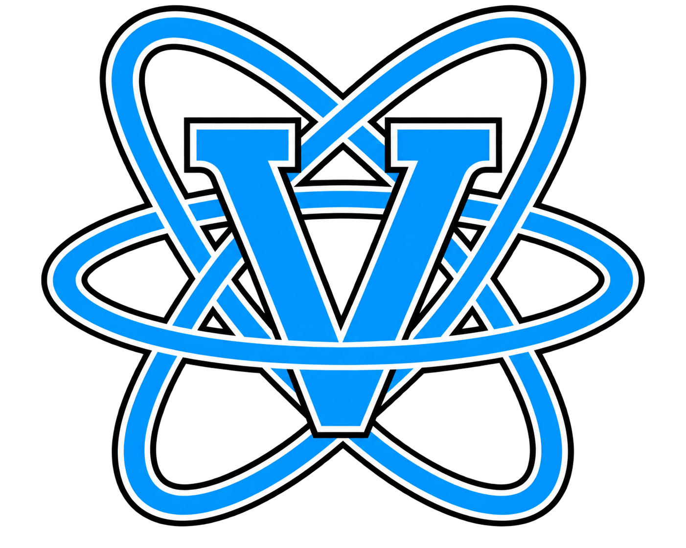

<p align="center">
  
</p>

# REACTOR V

**Real-time Embedded Application Component Toolkit & Overlay Runtime**

A shared React/HTML overlay framework for **GTA V Story Mode**, created by
**MinionEnjoyer**. Reactor hosts the interface; each mod keeps ownership of its
gameplay, settings, and saved data. ALLIN1 is an integration, not a prerequisite
for registering your own Reactor menus.

[Downloads](https://github.com/MinionEnjoyer/GTAV-REACTOR-V/releases) ·
[Managed extension API](docs/EXTENSIONS.md) · [Browser API](docs/API.md) ·
[Architecture](docs/ARCHITECTURE.md)

## Edition builds — 0.2.0 preview

Fullscreen overlays have been confirmed in local playtesting on both editions.
These are **edition-specific previews**, not a claim of compatibility with all
game updates or graphics configurations. Executable identity checks remain
enabled. Install **one** matching runtime ZIP, never both.

| Download | Tested game version | In-frame renderer |
| --- | --- | --- |
| `ReactorV-0.2.0-legacy-live-test.zip` | Legacy `1.0.3889.0` | D3D11, authenticated CPU-frame bridge |
| `ReactorV-0.2.0-enhanced-live-test.zip` | Enhanced `1.0.1158.13` | D3D12 / D3D11On12, shared GPU frames |

The historical `live-test` filenames and markers identify the guarded preview
profiles. These downloads are full runtime packages, **not incremental patches**.
Legacy includes `ReactorV.LegacyCpuFrames.enabled`; removing it changes the
renderer route and is not a supported troubleshooting step for this preview.
The Legacy producer is capped at 15 UI frames/second; this does not cap GTA FPS.

Do not use Reactor in GTA Online. Unsupported executables disable the native
render route instead of attempting unverified hooks. Vulkan is not supported.

## Install

1. Close GTA. Install an edition-compatible **Script Hook V / ASI loader** and
   **ScriptHookVDotNet v3** runtime. Enhanced requires its compatible v3 runtime.
   These third-party game-hook dependencies are **not included**.
2. Ensure .NET Framework 4.8 and Microsoft Edge WebView2 Runtime are installed.
   CEF/native renderer dependencies are included in the runtime ZIP.
3. Download the matching edition ZIP and its `.sha256` file from Releases. Check
   the ZIP using `Get-FileHash -Algorithm SHA256` before extracting it.
4. Extract into the GTA folder containing `GTA5.exe` or `GTA5_Enhanced.exe`.
   The layout is:

   ```text
   GTA root/
   ├─ ReactorV.Bootstrap.asi
   ├─ ReactorV.ScriptProbe.asi
   ├─ ReactorV.RenderHook.asi
   ├─ plugins/ReactorV/              browser host, renderer, UI, edition marker
   └─ scripts/ReactorV/              managed runtime and configuration
   ```

5. Launch GTA yourself. **F9** opens/closes Reactor's About panel on the main
   menu. In Story Mode, the installed mod owns its menu and keybindings; ALLIN1
   uses F9 for GBAY. Standalone starters use **F6** and **F7**. Escape/click-close
   behavior is managed by the active interface.

Reactor starts when GTA starts; the ALLIN1 launcher is not required. The early
bootstrap can display progress before the managed provider is ready. Rendering
readiness does not imply that ScriptHook gameplay callbacks are ready yet.

For an existing ALLIN1 installation, back up the runtime first and preserve
third-party extension assets/settings. The source-tree
`tools/install-live-test-package.ps1` provides edition/hash checks and ownership
preservation. Do not delete the entire `plugins/ReactorV` folder to uninstall a
single mod: other mods may depend on it.

## Configuration and diagnostics

`scripts/ReactorV/ReactorV.json` controls the managed interface. Defaults include
F9, `startVisible: false`, `showFirstRunSplash: false`, `renderer: auto`, and developer
tools disabled. `plugins/ReactorV/ReactorV.Preloader.json` controls the early
browser host. Edition preview packages enable the native browser route and ship
the matching version-gated marker; keep those files together.

Logs are written beneath `%LOCALAPPDATA%\ReactorV`. When reporting an issue,
include the edition, exact game version, display mode, which menu stage failed,
and the relevant session log. Do not publish personal paths or unrelated logs.

## Make a mod with Reactor

Reference the existing `RageWebUI.Core.dll`, register a unique extension ID,
declare typed actions and menus, and dispose the registration when your script
unloads. The browser cannot invent a native call or write a file: the owning
mod performs authorized actions on the GTA script thread.

The **Starter Kit 0.1.0 preview** includes two independently built SHVDN scripts
and source prefabs for settings, scrolling lists, grids, confirmations, and
status panels. Source builds now also include searchable catalogues (with empty
states), tabbed settings, service checklists/progress, and a compact side editor.
These examples use neutral in-memory data, not game assets or an economy.
The kit includes no Reactor runtime and does not modify other mods.
Both samples share one Core registry, without claiming F9 or automatically
opening a menu. Their settings are deliberately in-memory demonstrations.

Multiple mods can be registered and run together. Each uses a unique extension
ID and owns its callbacks and state; unloading one does not uninstall Reactor
or another mod. There is **one active menu/input owner at a time**, not several
overlapping independently focused overlays. Only one extension may claim the
default F9 menu; other mods can use their own keys or explicit menu navigation.
This is lifecycle/state isolation, not a sandbox for untrusted native/.NET mods.

From an extracted starter kit:

```powershell
dotnet build source/StarterA/StarterA.csproj -c Release
powershell -NoProfile -ExecutionPolicy Bypass -File Manage-Starter.ps1 -Mode Check -GameRoot 'C:\Games\GTAV' -PackageRoot packages/StarterA
```

Use `-Mode Install` after Check, and `-Mode Uninstall` to remove that starter
only. Substitute `StarterB` for the F7 sample. The process-scoped execution
policy flag does not change the machine policy; run only scripts you trust.
The installer blocks incompatible dependencies, unowned/modified files, and
cross-mod path claims. A missing owned DLL is reported as repair-required.
It does not claim that filesystem checks prove live graphics compatibility.

### Runtime versus consumer content

New source builds package the neutral Reactor menu and service preloader only.
GBAY, the ALLIN1 preloader/logo, catalogues, and consumer preview assets are not
part of that runtime UI. `pnpm build` produces `web/dist`; the retained ALLIN1
compatibility build is explicitly `pnpm build:allin1` → `web/dist-allin1`, used
by the consumer regression harness, never copied to a Reactor runtime ZIP.
Use **0.2.0 Preview 2 or newer** for this separation and the MIT/third-party
notices. Preview 1 predates the standalone-content split.

The standalone renderer can display typed menus from any registered extension.
It does **not** reproduce GBAY's specialized presentation. Existing ALLIN1
installations should keep their tested UI until their consumer-owned adapter is
deployed; do not overwrite them with the standalone UI expecting the same skin.
This is not yet a general-purpose consumer UI/dependency installer.

The build rejects consumer code in the compiled module graph and scans staged
UI hashes, file identities, and content using `reactor-ui.json`. Font license
notices are retained; development logs, game assets, and sample mod DLLs are not
included in the player runtime.

## Build and verify from source

Requirements: .NET SDK with .NET Framework targeting support, Node.js/pnpm,
CMake 3.24+, Visual Studio 2022 x64 C++, and the
[official ScriptHookV SDK](https://www.dev-c.com/gtav/scripthookv/).
Do not commit or redistribute the ScriptHook SDK with Reactor.

```powershell
./build-package.ps1 -IncludeExperimentalLegacyRenderHook -ScriptHookSdkRoot 'C:\SDKs\ScriptHookV'
./build-package.ps1 -IncludeExperimentalEnhancedRenderHook -ScriptHookSdkRoot 'C:\SDKs\ScriptHookV'
./tools/build-standalone-starter-kit.ps1
```

Run the edition builds sequentially: they share staging. Each edition package
must pass native CTest (no skips), managed and browser tests, graphics/browser
harnesses, required-file and export checks, path-leak scans, and size limits.
`-SkipTests`, `-SkipHarness`, or Debug are rejected for edition-hook packages.
Build receipts stay under `artifacts/harness`; player ZIPs exclude harness
executables, development logs, caches, and debug symbols. Automated graphics
harnesses are not a substitute for live GTA testing.

For browser-only development, run `pnpm install --frozen-lockfile` and `pnpm dev`
under `web`. The browser transport uses a mock game API outside GTA.

See [the renderer harness guide](docs/DIRECTX-HARNESS.md) and
[live acceptance guide](docs/LIVE-ACCEPTANCE.md) for deeper validation.

## License

MIT, copyright (c) 2026 MinionEnjoyer. See [LICENSE](LICENSE).
Included dependencies retain their own licenses; see
[third-party notices](THIRD_PARTY_NOTICES.md) and the packaged legal directory.
